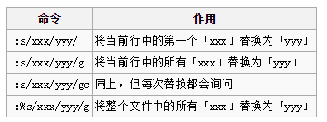
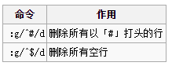
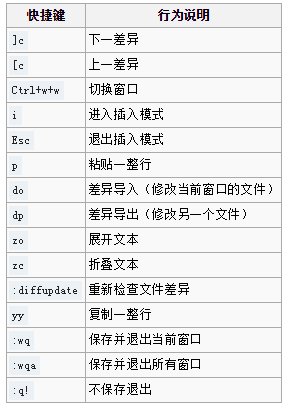
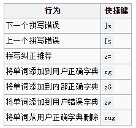

# 1. 安装
[安装](https://wiki.archlinux.org/index.php/%E5%AE%89%E8%A3%85) 下面两个软件包中的一个：
- [vim](https://www.archlinux.org/packages/?name=vim) — 提供 Python 2/3, Lua,Ruby 和 Perl 解释器支持，但没有 GTK/X 支持
- [gvim](https://www.archlinux.org/packages/?name=gvim) — 除了提供和 vim 一样的功能外，还提供了图像界面。
> **注意:**
- vim 包 **不包含** 图形界面支持。因此缺失了 `+clipboard` 特性，Vim 也就不能够同 X11 的 *primary* 和 *clipboard* 剪切板交互。*gvim** 包在全面支持图形界面的同时提供了命令行版本的 Vim。
- 非官方源 [herecura-stable](https://wiki.archlinux.org/index.php/Unofficial_user_repositories#herecura-stable) 也提供大量 Vim/gVim 变种版本: `vim-cli` `vim-gvim-common` `vim-gvim-gtk` `vim-gvim-qt` `vim-rt` 和 `vim-tiny`。

# 2.用法
这里仅是对 Vim 使用的基本介绍。你也可以运行 vimtutor/gvimtutor，启动内置的教程。
Vim 有四种不同的模式：
- 命令模式：键入的内容被解释为命令。
- 插入模式：键入的内容被插入文本中。
- 可视模式：通过键盘选择、剪切、复制文本。
- [Ex](https://en.wikipedia.org/wiki/Ex_(text_editor)) 模式：使用更多命令（例如：存储文件、替换文本等）。

## 2.1 基本编辑
如果通过以下命令启动 Vim：

```
$ vim somefile.txt
```

你会看到一个空白文档（假定 `somefile.txt` 不存在，否则会显示其内容）。但由于当前是命令行模式，你不能立即编辑文件。在该模式下你可以使用键盘触发 Vim 命令。
> 注意: Vim 是典型 UNIX 风格的软件。其学习曲线非常陡峭，但是掌握之后，你会发现它的功能非常强大。同时，所有命令都区分大小写。某些命令对应的大写版本代表「激进版本」（如 s 替换一个字符，S 替换一整行），而有时大小写则是完全不同的命令（如 j 代表光标下移，J 代表合并两行）。
你可以使用 `i` 命令输入文字（把它贴在光标前），大写（`I`）会在行首插入内容，使用 `a` 添加内容，输入 `A` 会将光标置于行尾。按 `Esc `可返回命令行模式。

## 2.2 光标移动
你可以使用方向键移动光标，然而这并不是 **Vim 的方式**。你不得不把右手一路从标准输入位置移动到方向键，然后再移动回来，很不方便。
向下移按 `j`，向上移回光标按 `k`，向左是 `h`，向右是 `l`（小写 L）。

```
  k
h   l
  j
```

`^`移动光标至行首，`$`则移至行尾。
> **注意:** `^`和`$`通常在正则表达式中匹配行首和行尾。正则表达式是一种很强大的工具，在 *nix 环境中被广泛使用。虽然这些快捷键对你可能有点陌生，但以后你会注意到使用这些按键映射背后的“想法”。
跳过一个单词，按 `w`键。`W `认定的单词包含更多的字符（例如：下划线和斜杠都会被认做单词的一部分）。将光标前移动一个单词使用 `b`。同样，`B` 在 vim 中认定的单词包含更多的字符。将光标移至当前单词的末尾使用 `e`，`E` 包含更多的字符。
`(`将光标移至当前句子的句首，`)`至句末。如果需要移动更远的距离，`{`可移至段首，`}`至段尾。
`H `将光标移至当前屏幕上显示的第一行，`M `至屏幕中央，`L` 则是至屏幕上的最后一行。`gg `将光标移至文件的开始，`G `至文件结尾。

## 2.3 重复命令
如果一个命令前用数字 *n* 修饰，那么这个命令就会执行 *n* 次（虽然有些命令例外，例如 `s`，但这仍然很有用）。例如，按下 `3i`，输入 `Help!`  ，然后按下 `Esc`，会打印 `Help! Help! Help!`  。输入`2}`将光标后移两个段落。这在以下几个命令中经常使用。

## 2.4 删除
`x `命令删除光标所在处的字符，`X `删除光标前的字符。使用上面的技巧，`6x `会删除6个字符。用`.`（半角句号）可以重复前一个命令。所以，假如你有多个「foobar」，但决定将其修改为「foo」，那么，将光标移动至「b」处，键入`3x`，移动至下一个单词的「b」处，按下`.`即可。
`d` 代表你将要删除一些内容，在按下 `d` 之后，你需要继续指定需要删除的内容。这时你可以搭配移动光标的命令。`dW` 可以删除至下一个单词，`d^`可以删至行首。删除命令也可以前缀数字，如 `3dW` 可以删除光标之后的三个单词。大写的 `D `可以删除至行尾（等同于 `d$`），`dd `可以删除整行。
`cw `可以删除并替换当前单词，这个命令将删除单词并进入插入模式。`r `可以替换单个字符。

## 2.5 撤销与恢复
Vim 内置了剪贴板（也叫缓冲区）。使用 `u `撤销命令，`Ctrl+r `可恢复之前撤销的命令。

## 2.6 可视模式
命令行模式按 `v `进入可视模式。该模式下通过光标移动选择文本，选取后按 `y` 可以把文本提取到缓冲区（即复制），`c `可以剪切。之后可以使用` p` 在光标后粘贴，`P `粘贴在光标前。`V `是行选取模式，以行为单位进行选取。`Ctrl+v `是块选取模式，可以选取一块矩形区域中的文本。
> **注意:** 删除的内容将存储在缓冲区，可以通过粘贴命令提取。

## 2.7 搜索和替换
在文件中搜索单词或字母的话，按下 `/`，输入搜索内容，按下回车。`n `查找下一处匹配，`N `查找上一处。
替换文本需要使用`:s/`命令（注意冒号），格式为`:[范围]s/[原字符串]/[新字符串]/[参数]`。例如：

可以用`:g/`命令匹配字符串（注意冒号），并对每个匹配执行同一操作。格式为`：[范围]:g/[模式串]/[命令]`。例如：


## 2.8 保存和退出
要在 Ex 模式执行保存和退出，Ex 模式命令都以`:`打头。`:w `保存文件，`:w [文件名]`可以指定文件名。`:q `退出，`:q!`放弃修改并退出。`:x `保存并退出（等同于`:wq`）。

## 2.9 其他命令
1. `s` 删除光标处字符并进入插入模式，`S` 删除当前行并进入插入模式。
2. `o` 在当前行后插入空行并进入插入模式，`O` 在当前行前插入空行并进入插入模式。
3. `yy` 复制当前行。
4. `cc` 删除当前行并进入插入模式。
5. `*`与`#`可以搜索当前光标下的单词，后者是向前搜索。

# 3. 配置
用户配置文件为`~/.vimrc`，相关的文件位于`~/.vim/`；全局配置文件为`/etc/vimrc`，相关的文件位于`/usr/share/vim/`。
如果需要常用的功能（如语法高亮、打开文件时回到上一次的光标位置等），可以使用配置文件范例：

```
/etc/vimrc/
...
runtime! vimrc_example.vim
```

## 3.1 文件备份
编辑文件后，Vim 默认会在文件所在目录建立名为`文件名~`的备份文件。为避免备份文件弄乱文件夹，许多用户在配置文件中加入下面内容，使Vim在指定文件夹生成备份：

```
set backupdir=~/.vim/backup,/tmp
```

也有人选择直接关闭该功能：

```
set nobackup
set nowritebackup
set noswapfile    ! (additionally disable swap files)
```

## 3.2 代码高亮
Vim 支持许多语言的代码高亮：

```
:filetype plugin on
:syntax on
```

## 3.3 使用鼠标
Vim 可以使用鼠标：

```
set mouse=a
```

> **注意:**
- 这个方法在 PuTTY 中同样适用。
- 在 PuTTY 中，通常的高亮/复制行为有所不同，因为在使用鼠标时，Vim 会进入可视模式。为了用能鼠标选中文本，需要同时按住 `Shift` 键。

## 3.4 跨行移动光标
默认情况下，在行首按`←`或者在行尾按`→`不能将光标移动至上一行或下一行。如果需要修改的话：

```
set whichwrap=b,s,<,>,[,]
```

## 3.5 vimrc 范例
一个配置文件范例：[#配置范例](https://wiki.archlinux.org/index.php/Vim_(%E7%AE%80%E4%BD%93%E4%B8%AD%E6%96%87)#.E9.85.8D.E7.BD.AE.E8.8C.83.E4.BE.8B)。更多范例参见[#其他资源](https://wiki.archlinux.org/index.php/Vim_(%E7%AE%80%E4%BD%93%E4%B8%AD%E6%96%87)#.E5.85.B6.E4.BB.96.E8.B5.84.E6.BA.90)。

# 4. 文件合并（Vimdiff）
Vim 自带了一个文件差异编辑器（diff，用来合并文件差异的工具）。vimdiff 可以打开多个窗口显示不同文件，按行高亮其差异。这时你只有两个模式：插入模式用以编辑文件，或者屏幕模式切换不同的窗口或行。从终端中调用它的命令为：`vimdiff 文件1 文件2`。基本操作：

编辑完成之后重命名：

```
mv file file.bck
mv file.pacnew file
```

检察新文件是否正确，然后删除备份：

```
rm file.bck
```

# 5. 技巧和建议
一些有用的技巧和建议。

## 5.1 帮助系统
Vim 提供了一个很完善的帮助系统，可以通过 `:h` 或 `:h subject` 打开; 内容包括基本的使用和配置帮助。高亮的内容可以通过 `Ctrl-]` 跳转，用 `Ctrl-T` 返回。用 `:q` 关闭帮助窗口。

## 5.2 显示行号
1. 使用`:set number `显示行号。
2. 使用`:set relativenumber `显示相对行号。
3. 使用`:<行号>G `跳到指定行。

## 5.3 拼写检查

```
set spell
```

Vim 默认只安装了英语字典，其他字典需要从[官方软件仓库](https://wiki.archlinux.org/index.php/Official_repositories_(%E7%AE%80%E4%BD%93%E4%B8%AD%E6%96%87))安装。检查可用语言包：

```
# pacman -Ss vim-spell
```

此外，还可以从 [Vim FTP archive](http://ftp.vim.org/vim/runtime/spell/) 获取字典。把下载的字典文件存入`~/.vim/spell`，然后将以下内容加入配置文件：`:setlocal spell spelllang=LL`


> **小贴士:**
- 如果想只对 LaTeX（或 TeX）文档起用拼写检查，在`~/.vimrc `或`/etc/vimrc `添加 `autocmd FileType tex setlocal spell spelllang=en_us`，重启 Vim 即可。至于非英语语言，替换上述语句中的 `en_us `为相应语言代码即可。
- 如果需要针对两种语言进行拼写检察（例如英语与德语），在`~/.vimrc `或`/etc/vimrc `中添加 `set spelllang=en,de `并重启 Vim 即可。
- 利用 FileType 插件和自建规则，可以对任意文件类型开启拼写检查。例如，要开启对扩展名为`.txt `的文件的拼写检查，创建文件`/usr/share/vim/vimfiles/ftdetect/plaintext.vim`，添加内容 `autocmd BufRead,BufNewFile *.txt setfiletype plaintext`，然后在 `~/.vimrc `或`/etc/vimrc `添加 `autocmd FileType plaintext setlocal spell spelllang=en_us`，重启 vim 即可。

## 5.4 跨行替换
下面的命令可以替换特定行中的内容：

```
:n,ns/one/two/g
```

例如，替换3、4两行中的'one'为'two'：

```
:3,4s/one/two/g
```

## 5.5 记录光标位置
Vim 可以记录上次打开某一文件时的光标位置，并在下次打开同一文件时将光标移动到该位置。要开启该功能，在配置文件`~/.vimrc `中加入以下内容：

```
augroup resCur
  autocmd!
  autocmd BufReadPost * call setpos(".", getpos("'\""))
augroup END
```

另见：[Vim Wiki 上的相关内容](http://vim.wikia.com/wiki/Restore_cursor_to_file_position_in_previous_editing_session)。

## 5.6 GVim 窗口底部的空格
如果窗口管理器设置为忽略窗口大小渲染窗口，GVim 会将空白区域填充为 GTK 主题背景色，看起来会比较难看。
一个解决方法是通过 `.vimrc` 禁用菜单栏，这样 gvim 窗口就能正常显示，填充整个空间：

```
set go-=m "remove menubar
```

解决办法是手动设置背景色。将以下内容加入`~/.gtkrc-2.0`：

```
style "vimfix" {
  bg[NORMAL] = "#242424" # GVim Normal主题的背景色
}
widget "vim-main-window.*GtkForm" style "vimfix"
```

## 5.7 用 vim 替代 vi

```
alias vi=vim
```

## 5.8 DOS/Windows 回车问题
打开 MS-DOS 或 Windows 下创建的文本文件时，经常会在每行行末出现一个「^M」。这时由于 MS-DOS/Windows 换行符与 UNIX 的不同导致的。
解决方案是使用下列命令替换掉所有的「^M」：

```
:%s/^M//g
```

注意，「^」代表控制字符。输入「^M」的方法是：`Ctrl+Q`
另一个方法是，安装 [dos2unix](https://www.archlinux.org/packages/?name=dos2unix)，然后执行 `dos2unix <文件名>`。

# 6. 插件
使用插件来提高效率，它能改变 Vim 的界面，添加新命令，代码自动补全，整合其他程序和工具，添加其他编程语言等功能。

## 6.1 插件安装和管理
通过 plugin manager 来跨平台安装和管理Vim的插件，安装 plugin manager 插件来方便管理其他插件。
- [Vundle](https://github.com/gmarik/Vundle.vim) 是目前最流行的 Vim 插件管理器。
- [Vim-plug](https://github.com/junegunn/vim-plug) 是精简的 Vim 插件管理器，可以按需加载插件并进行并行更新。
- [pathogen.vim](https://github.com/tpope/vim-pathogen) 可以用来管理 runtimepath。

### 6.1.1 pacman
[vim-plugins](https://www.archlinux.org/groups/x86_64/vim-plugins/) 包里有很多插件可以选择。

```
pacman -Ss vim-plugins
```

## 6.2 cscope
[Cscope](http://cscope.sourceforge.net/) 是一个代码浏览工具。通过导航到一个词/符号/函数并通过快捷键调用cscope，能快速找到：函数调用及函数定义等。需要多个步骤来搜索代码库。
安装 [cscope](https://www.archlinux.org/packages/?name=cscope) 包。
拷贝 cscope 预设文件，该文件会被 Vim 自动读为:

```
mkdir -p ~/.vim/plugin
wget -P ~/.vim/plugin 
http://cscope.sourceforge.net/cscope_maps.vim
```

> **注意:** 在 Vim 的 7.x 版本中，你可能需要在`~/.vim/plugin/cscope_maps.vim `中取消下列行的注释来使能 cscope 快捷键：

```
set timeoutlen=4000
set ttimeout
```

创建一个文件来包含你希望 cscope 索引的文件：

```
cd /path/to/projectfolder/
find . -type f -print | grep -E '\.(c(pp)?|h)$' > cscope.files
```

创建 cscope 会读取的数据文件：

```
cscope -bq
```

> 注意: 你必须从当前出浏览工程文件，也可以设置 $CSCOPE_DB 变量并指向 cscope.out 文件。
默认快捷键：

```
 Ctrl-\ and
      c: Find functions calling this function
      d: Find functions called by this function
      e: Find this egrep pattern
      f: Find this file
      g: Find this definition
      i: Find files #including this file
      s: Find this C symbol
      t: Find assignments to
```

你可以定制你自己的快捷键：

```
#使用 ctrl-c 来找到调用当前函数的函数 
nnoremap <C-c> :cs find c <C-R>=expand("<cword>")<CR><CR>
```

### 6.2.1 Taglist
[Taglist](http://vim-taglist.sourceforge.net/) 提供源码文件的结构概览，使你能更高效的浏览不同语言的源文件。
安装 [vim-taglist](https://www.archlinux.org/packages/?name=vim-taglist) 包。
将下列设置添入文件`~/.vimrc`:

```
let Tlist_Compact_Format = 1
let Tlist_GainFocus_On_ToggleOpen = 1
let Tlist_Close_On_Select = 1
nnoremap <C-l> :TlistToggle<CR>
```

# 7. 参阅

## 7.1 官方资源
- [Vim 主页](http://www.vim.org/)
- [Vim 文档](http://vimdoc.sourceforge.net/)
- [Vim Tips Wiki@wikia](http://vim.wikia.com/)

## 7.2 教程
- [中文版《A Byte of Vim》](http://www.swaroopch.com/notes/Vim_zh-cn)
- [vi 教程和参考指南](http://usalug.org/vi.html)
- [vim Tutorial and Primer](http://www.danielmiessler.com/study/vim/)
- [vi Tutorial and Reference Guide](http://usalug.org/vi.html)
- [Graphical vi-Vim Cheat Sheet and Tutorial](http://www.viemu.com/a_vi_vim_graphical_cheat_sheet_tutorial.html)
- [Vim Introduction and Tutorial](http://blog.interlinked.org/tutorials/vim_tutorial.html)
- [Open Vim](http://www.openvim.com/) - Vim 教学工具集合
- [Learn Vim Progressively](http://yannesposito.com/Scratch/en/blog/Learn-Vim-Progressively/)
- [know vim](http://www.knowvim.com/) [[dead link](https://en.wikipedia.org/wiki/Wikipedia:Link_rot) 2014-10-29]
- [Learning Vim in 2014](http://benmccormick.org/learning-vim-in-2014/)

### 7.2.1 视频
- [Vimcasts](http://vimcasts.org/) - ogg 格式的视频教程
- [Vim Tutorial Videos](http://derekwyatt.org/vim/tutorials/) - 从入门到精通，各种视频教程

### 7.2.2 游戏
- [Vim Adventures](http://vim-adventures.com/)
- [VimGolf](http://vimgolf.com/)

## 7.3 配置范例
- [nion's](http://nion.modprobe.de/setup/vimrc)
- [A detailed configuration from Amir Salihefendic](http://amix.dk/vim/vimrc.html)
- [Bart Trojanowski](http://www.jukie.net/~bart/conf/vimrc)
- [Steve Francia's Vim Distribution](https://github.com/spf13/spf13-vim)
- [W4RH4WK's Vim configuration](https://github.com/W4RH4WK/dotVim)
- [Fast vimrc/colorscheme from askapache](http://www.askapache.com/linux/fast-vimrc.html)
- [Basic .vimrc](https://gist.github.com/anonymous/c966c0757f62b451bffa)

## 7.4 其他
- [HOWTO Vim](http://www.gentoo-wiki.info/HOWTO_VIM) -- Gentoo Wiki 的 Vim 介绍，本文基于该文修改而来
- [Vivify](http://bytefluent.com/vivify/) - Vim 颜色编辑器 ColorScheme Editor for Vim
- [Usevim](http://www.usevim.com/) - 经常更新的高亮插件博客、提示等
- [Vim Awesome](http://vimawesome.com/) - 该网站展示由 Github 用户评分的 Vim 插件
- [Basic Vim Tips](http://bencrowder.net/files/vim-fu/) - 为新人准备的 Vim 文档